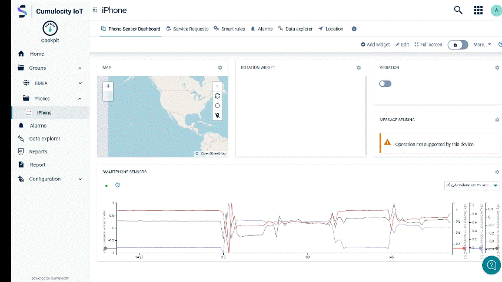
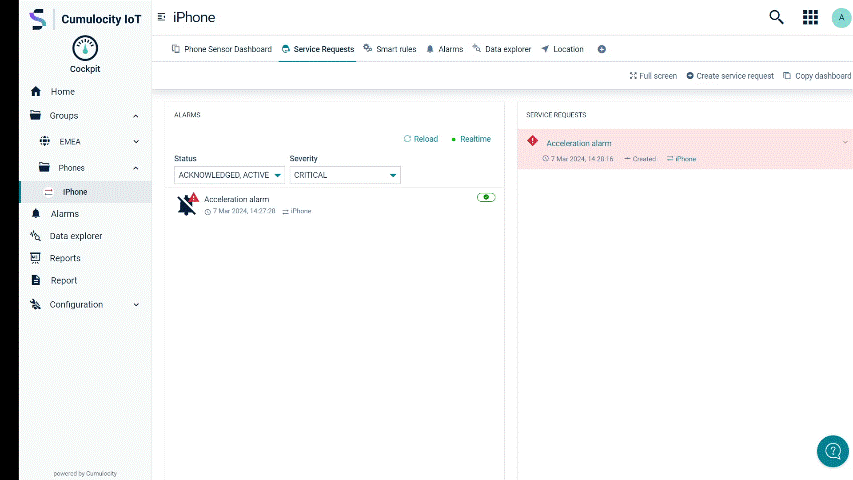

# Service request plugin

This plugin extends Cumulocity application like Cockpit with the capability to create, update and manage service requests.

The UI Plugin is depending on the domain specific API provided by [service-request-mgmt microservice](https://github.com/SoftwareAG/cumulocity-microservice-service-request-mgmt):
[Open API documentation](https://github.com/SoftwareAG/cumulocity-microservice-service-request-mgmt/blob/develop/docs/README.md)

This microservice can be extended or even replaced if needed. Custom microservices have to implement the REST API as documented above.

# Requirements

This plugin requires a Microservice called Service-request-mgmt to be installed on the tenant.
Repository: [Standard cumulocity-microservice-service-request-mgmt](https://github.com/SoftwareAG/cumulocity-microservice-service-request-mgmt)

# Create Service Request



The service request can be created for an alarm as shown in the screenshot above or with out any context via (+) button "Create service request". The service request will be stored at Cumulocity. If the service request is created and a alarm status transition is configured the alarm status will change to the configured status, in that example the alarm changes to ACKNOWLEDGED.


# Create Comment for Service Request



There are SYSTEM comments and USER comments. SYSTEM comments reflect specific changes at the service request object and show the status history of it. USER comments can be created by any user which is allowded to create service requests. Service request comments are a very sufficient way to communicate with the field service technician in the device context. 

# Attachments


Each service request and each comment can have arbitrary files like pictures, excel documents etc. as attachment. This attachments allow the user to add additional information for the field service team. 

## Recommended versions
* node ^18.19.1 || ^20.11.1 || ^22.0.0
* npm 10.x.x

## Plugin versions
* Angular 18.x.x
* WebSDK 1021.x.x

**How to start**
Change the target Cumulocity tenant and application you want to run this plugin on in the `package.json` and replace `{{C8Y_URL}}`.

```
ng serve -u {{C8Y_URL}} --shell cockpit
```

Keep in mind that this plugin needs to have an app (e.g. cockpit) running with at least the same version as this plugin. if your tenant contains an older version, use the c8ycli to create a cockpit clone running with at least 1021.x.x! Upload this clone to the target tenant (e.g. cockpit-1021) and reference this name in the --shell command.

The widget plugin can be locally tested via the start script:

```
npm start
```

In the Module Federation terminology, `widget` plugin is called `remote` and the `cokpit` is called `shell`. Modules provided by this `widget` will be loaded by the `cockpit` application at the runtime. This plugin provides a basic custom widget that can be accessed through the `Add widget` menu.

> Note that the `--shell` flag creates a proxy to the cockpit application and provides `ServiceRequestPluginModule` as an `remote` via URL options.

Also deploying needs no special handling and can be simply done via `npm run deploy`. As soon as the application has exports it will be uploaded as a plugin.

# Useful links 

📘 Explore the Knowledge Base   
Dive into a wealth of Cumulocity IoT tutorials and articles in our [Tech Community Knowledge Base](https://techcommunity.cumulocity.com/c/knowledge-base/7).  

💡 Get Expert Answers    
Stuck or just curious? Ask the Cumulocity IoT experts directly on our [Forum](https://techcommunity.cumulocity.com/c/forum/5).   

🚀 Try Cumulocity IoT    
See Cumulocity IoT in action with a [Free Trial](https://www.cumulocity.com/start-your-journey/free-trial/).   

✍️ Share Your Feedback    
Your input drives our innovation. If you find a bug, please create an issue in the repository. If you’d like to share your ideas or feedback, please post them [here](https://techcommunity.cumulocity.com/c/feedback-ideas/14). 

More to discover
* [How to install a Microfrontend Plugin on a tenant and use it in an app?](https://techcommunity.cumulocity.com/t/how-to-install-a-microfrontend-plugin-on-a-tenant-and-use-it-in-an-app/3034)  
* [Cumulocity IoT Web Development Tutorial - Part 1: Start your journey](https://techcommunity.cumulocity.com/t/cumulocity-iot-web-development-tutorial-part-1-start-your-journey/4124) 
* [The power of micro frontends – How to dynamically extend Cumulocity IoT Frontends](https://techcommunity.cumulocity.com/t/the-power-of-micro-frontends-how-to-dynamically-extend-cumulocity-iot-frontends/2577)  

------------------------------
These tools are provided as-is and without warranty or support. They do not constitute part of the Software AG product suite. Users are free to use, fork and modify them, subject to the license agreement. While Software AG welcomes contributions, we cannot guarantee to include every contribution in the master project.
